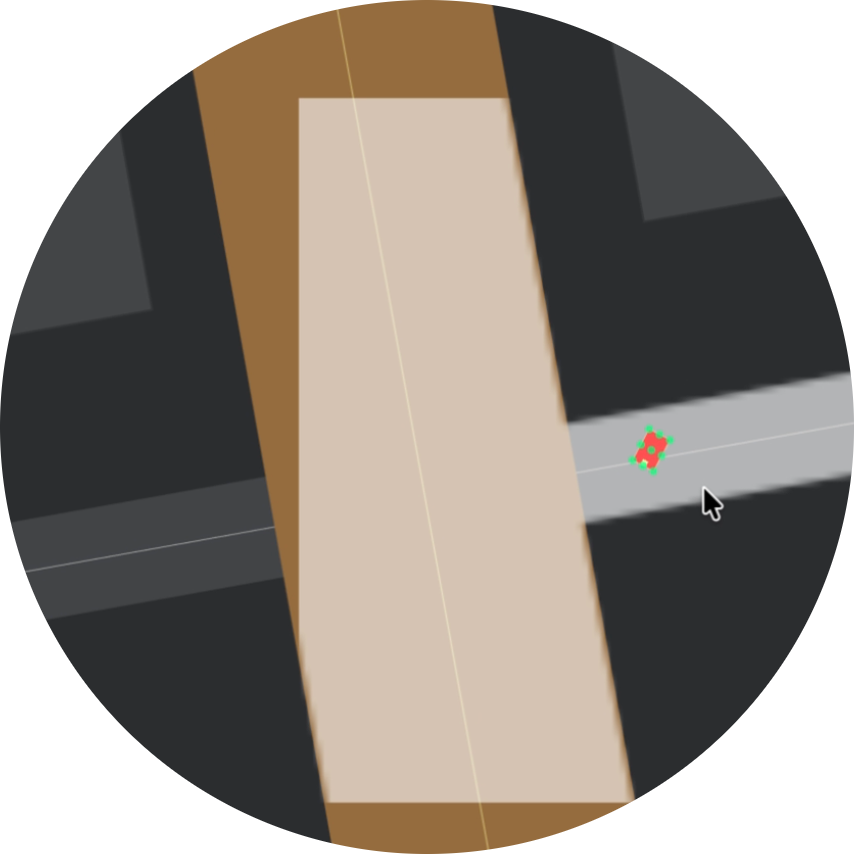
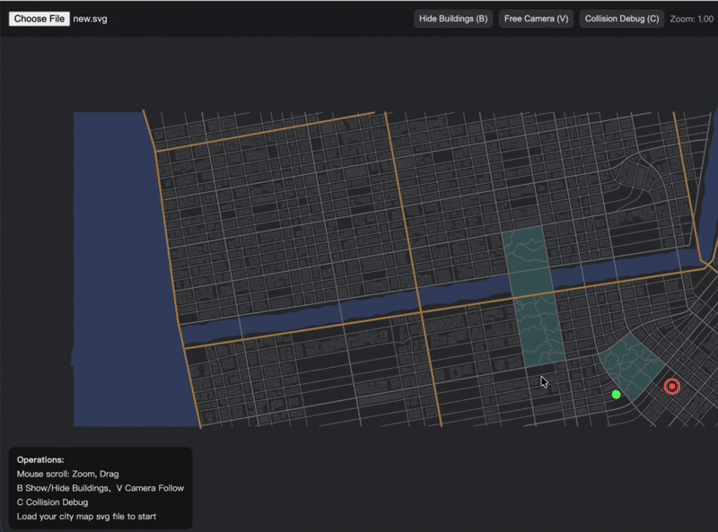

<p align="center">
  
</p>

<h1 align="center">MetaTraffic</h1>
<p align="center">
  A multi-agent environment runtime for studying coordination under partial observability
</p>

MetaTraffic is a multi-agent reinforcement learning environment runtime for training and evaluating decentralized policies under realistic perception constraints.

The system focuses on **environment design, simulation dynamics, and agent interaction**, rather than model architecture alone. It is designed as a lightweight prototype of an agent training environment for real-world tasks.
<p align="center">
  
</p>


## Overview

Most RL environments assume either:

* single-agent control, or
* fully observable global state

MetaTraffic explores a more realistic setting:

> Multiple agents interacting in a shared world, with limited local perception and competing objectives.

This setup is closer to real-world systems such as autonomous driving or robotic coordination.

---

## Core Idea

Instead of exposing full world state, each agent observes a **local spatial representation** of the environment.

This is implemented as a rasterized road mask centered on the agent, functioning as a lightweight **occupancy grid**, similar to LiDAR or radar perception in real systems.

This forces agents to learn:

* local decision making
* implicit coordination
* behavior under partial observability

---

## System Architecture

```
Map (SVG)
  → Road Graph Generation
    → Rasterized Mask (World Representation)
      → Physics Engine (Vehicle Dynamics)
        → Environment Runtime (DrivingEnv)
          → RL Training Loop
            ↘ Visualization / Debugging
```

---

## Environment Runtime

The system implements a Gym-like interface:

* `reset()` → initialize episode with randomized start/goal
* `step(action)` → advance simulation

Returns:

* observation
* reward
* done

This design separates **world simulation** from **agent interaction**, making the environment reusable for different training setups.

---

## Observation Model (Perception)

Each agent receives:

* 32×32 local spatial mask (road / obstacle encoding)
* normalized velocity
* heading direction (cos, sin)
* relative displacement to goal

This enforces **partial observability** and removes access to global state.

---

## Simulation Dynamics

Each episode consists of:

* generated or selected map
* randomized agent spawn points
* individual destinations

At every step, the system:

1. updates world state
2. applies agent actions
3. resolves collisions and constraints
4. computes rewards
5. returns next observations

---

## Reward Design

The environment includes stabilization mechanisms:

* potential-based shaping
* progress rewards
* collision penalties
* off-road penalties with temporal tracking
* stuck detection using history windows

These are critical for maintaining learning stability in multi-agent settings.

---

## Key Challenges Explored

### Coordination under Partial Observability

* limited local perception
* delayed reactions
* emergent congestion

---

### Scaling Multi-Agent Interaction

* collision frequency grows non-linearly
* coordination instability
* noisy reward signals

---

### Environment-Induced Instability

* procedural map variation
* distribution shift
* inconsistent optimal policies

---

## Training

* Algorithm: MADDPG
* Continuous control
* Multi-agent training
* Parallel rollout support

The focus is not the algorithm itself, but how **environment design shapes learning dynamics**.

---

## Debugging & Visualization

* real-time simulation rendering
* collision inspection
* trajectory visualization
* shared pipeline between training runtime and web interface

This enables consistent behavior across simulation and visualization environments.

---

## Map Generation

The road network generation is adapted from:
https://github.com/ProbableTrain/MapGenerator

We extended it to function as part of the environment runtime:

* integrated into the environment reset pipeline
* converted vector maps into rasterized masks for fast spatial queries
* unified usage across Python training and web visualization

This transforms the generator from a standalone tool into a reusable simulation component.

---

## Limitations

* not distributed across multiple machines
* limited agent communication mechanisms
* not benchmarked against standard MARL suites
* scaling beyond current agent count requires further optimization

---

## Why This Matters

Real-world AI systems operate under:

* partial observability
* noisy perception
* shared environments
* interacting agents

MetaTraffic provides a controlled environment to study these properties, bridging simulation and real-world system constraints.

---

## Repository Structure

```
RL/
  env.py
  physics.py
  train_parallel.py
  train_single.py

Web/
  visualization / interface
```

---

## Acknowledgements

Road generation is adapted from:
https://github.com/ProbableTrain/MapGenerator

Extended for environment integration and cross-runtime usage.
